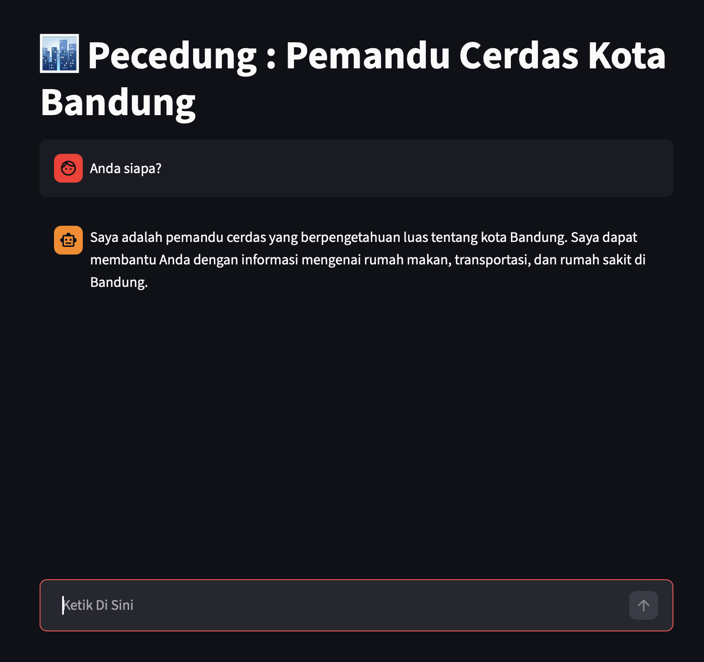

# PECEDUNG : Pemandu Cerdas Kota Bandung
## Panduan menjalankan aplikasi
1. Buat environment python, lalu install package yang ada di dalam `requirements.txt`
2. Buatlah API Key dalam Google AI Studio, lalu tambahkan dalam file conf/.env.example (Jika akan digunakan jangan lupa menghapus `.example` pada nama file, sehingga nama file adalah `conf/.env`)
```
GEMINI_API_KEY = "<API KEY GEMINI>"
```
3. Kemudian, buatlah vector database secara lokal dengan menjalankan script `storing_docs.py`
```
python storing_docs.py
```
4. Setelah itu, jalankan aplikasi streamlit dengan menggunakan command berikut ini
```
streamlit run main.py
```
Anda akan mendapati tampilan berikut ini



## Referensi Dokumen RAG
1. https://www.kompas.com/food/read/2023/09/02/131700875/35-tempat-makan-enak-di-bandung-dari-legendaris-hingga-kekinian?page=all
2. https://transportforbandung.org/peta/bus-kota
3. https://www.rumah123.com/explore/kota-bandung/rumah-sakit-di-bandung/